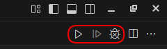
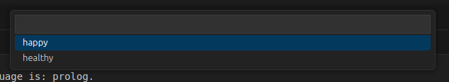
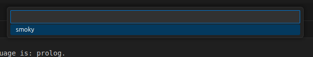
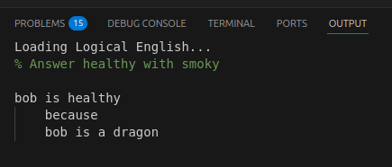
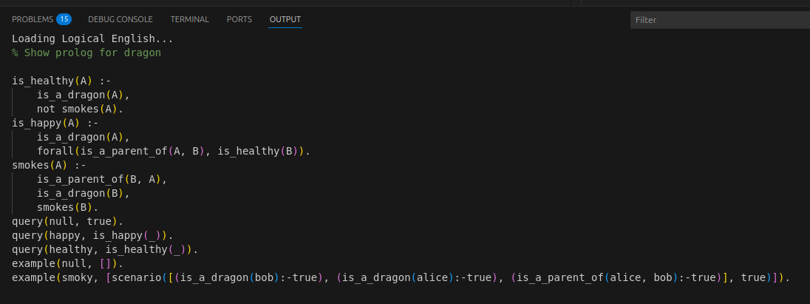

# Running Queries in Logical English

When you open a Logical English file (`.le`), the editor displays three buttons in the top right corner:

1. ▶️ **Run Query**  
   Click this button to execute the selected query in your Logical English file. The result will be shown in the "Logical English" output panel.

2. ⏭️ **Next Solution**  
   If your query has multiple possible answers, this button will activate. Each click will show the next available answer.

3. 🐞 **Show Prolog Code**  
   Click this button to view the Prolog code generated from your Logical English file. This is useful for understanding how your rules and scenarios are translated.

## Running a Query

When you run a query, you will see two popups: one for the query and one for the scenario.  
Select one of each by clicking or typing, and the reasoner will evaluate the result and open a tab with the answer.

In the example, if you select query `healthy` and scenario `smoky`, a panel will appear with the result:

If there are multiple answers, the **Next Solution** button will activate. You can continue clicking it until there are no more solutions.

---

## Viewing the Generated Prolog Code

To view the generated Prolog code, click the **Show Prolog Code** button.  
This will open a panel displaying the translation of your Logical English rules and scenarios into Prolog syntax.

Use this view to better understand how your Logical English statements are interpreted by the reasoner.

---

## Tips

- You can also run these commands from the Command Palette (`Ctrl+Shift+P` or `Cmd+Shift+P`) by searching for "Logical English".
- The output panel will display answers, explanations, and any errors encountered during query execution.
- If you edit your file, remember to save before running queries again.

---

Ready to explore your Logical English program?  
Try running a query and see